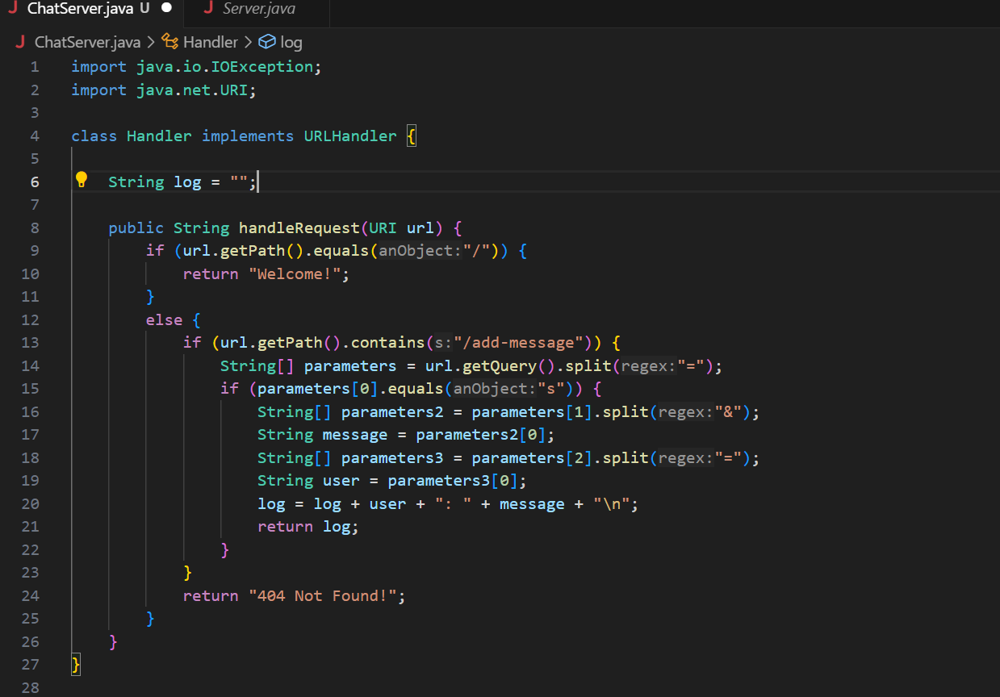
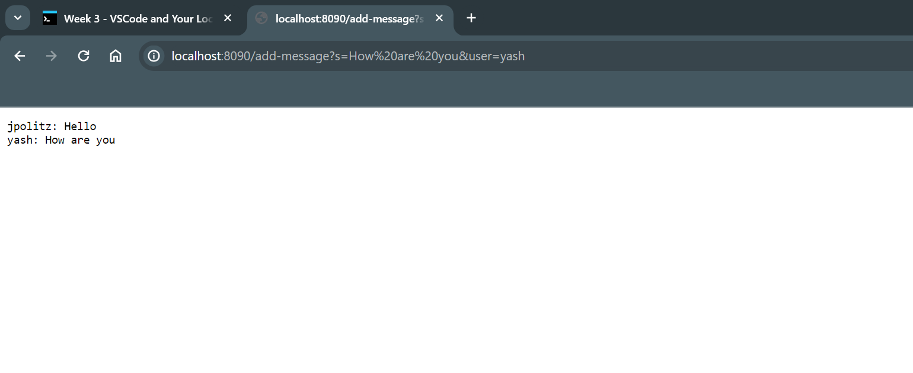
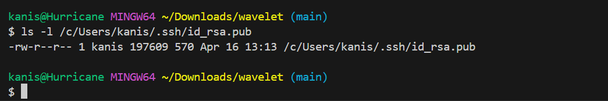

<b>Lab Report 2  </b>
<b>Part 1  </b>
 
 
1) When the `handleRequest` method is called, it starts by calling the `getPath` method to obtain the String with the url path. It then uses `equals()` to check if the url is to the main page, and if not it goes into the else block. In the else block, it uses `getPath` again and `getQuery()` to get the query part of the url as a String. This it uses the `split()` method to break up the string to read the input from the url. 
2) The `handleRequest` method has a parameter for a URI object which allows use to access the browser URL and convert it into Strings. The `handleRequest` method modifies the `log` instance field which will be displayed on the page.  
3) The only field in the class being `log` is modified by setting it equal to itself (an empty String) concatenated with `"jpolitz: Hello \n"`  
  
1) Same as the first screenshot except run twice. When the `handleRequest` method is called, it starts by calling the `getPath` method to obtain the String with the url path. It then uses `equals()` to check if the url is to the main page, and if not it goes into the else block. In the else block, it uses `getPath` again and `getQuery()` to get the query part of the url as a String. This it uses the `split()` method to break up the string to read the input from the url. 
2) Same was the first screenshot except run twice. The `handleRequest` method has a parameter for a URI object which allows use to access the browser URL and convert it into Strings. The `handleRequest` method modifies the `log` instance field which will be displayed on the page. 
3) The `log` field gets modified a second time by the second request. At this point `log` contains `"jpolitz: Hello \n"` and it will be modifed in the same way. This time it wil concatenate itself with `"yash: How are you \n"` and display `log` on the page.   
<b>Part 2  </b>
 
 
  
<b>Part 3  </b>
Before week 2, I had had essentially no experience with programming and running my own server. I learned a lot about the reading the paths of URLs and using that to produce outputs on the page. I also learned a bit more about the process of debugging and the mindset you should have while doing it. 

