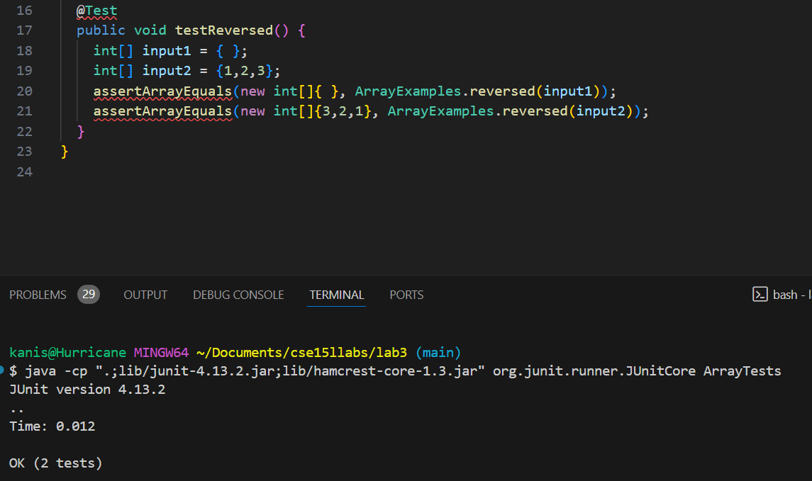
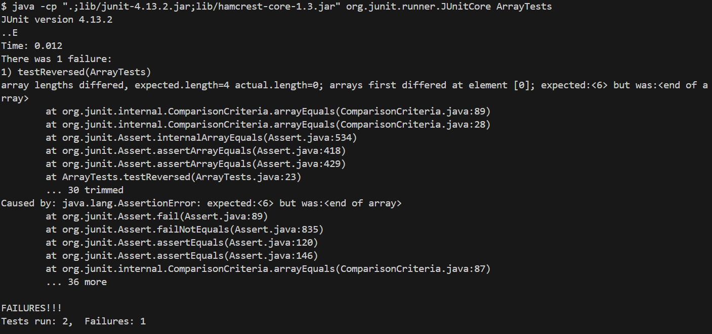
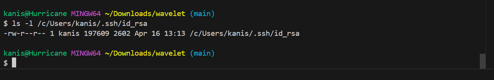
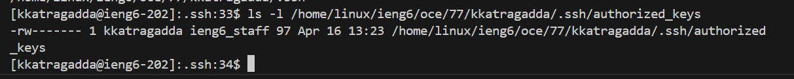
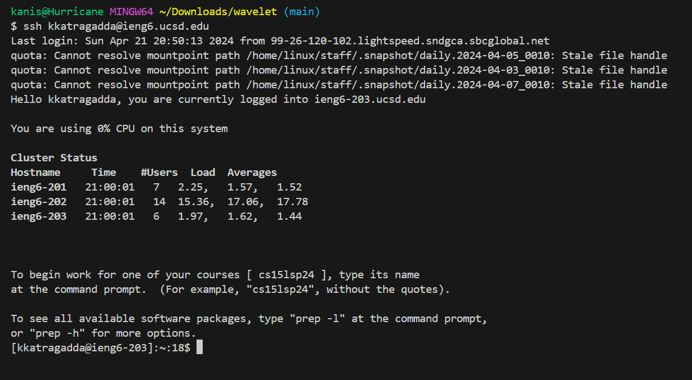

<b>Lab Report 2 <br></b>
<b>Part 1 <br></b>
Failure Inducing Input<br>
`int[] input3 = {1,2,3};`
`assertArrayEquals(new int[]{3,2,1}, ArrayExamples.reversed(input1));`<br>
Non-Failure Inducing Input<br>
`assertArrayEquals(new int[]{ }, ArrayExamples.reversed(input1));`<br>
<br>
<br>
Before:<br>
```
  static int[] reversed(int[] arr) {
    int[] newArray = new int[arr.length];
    for(int i = 0; i < arr.length; i += 1) {
      arr[i] = newArray[arr.length - i - 1];
    }
    return arr;
  }
```
After:<br>
```
  static int[] reversed(int[] arr) {
    int[] newArray = new int[arr.length];
    for(int i = 0; i < arr.length; i += 1) {
     newArray[i] = arr[arr.length - i - 1];

    }
    return newArray;

  }
```
The bug in the original was that the original array was being initialized to the values of the `newArray` which is what was meant to hold the reversed array. To fix this, switch the initialization was `newArray` is being initialized to the reverse of `arr` and return `newArray`.<br>
<b>Part 2 <br></b>
<br>
<br>
<br><br>
<b>Part 3 <br></b>

