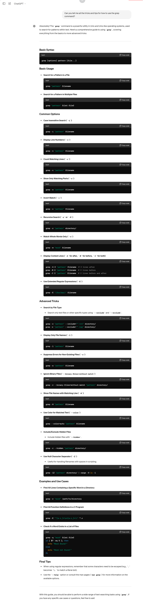

<b>Lab Report 2 <br></b>
<b>Part 1 <br></b>
Failure Inducing Input<br>
`int[] input3 = {1,2,3};`
`assertArrayEquals(new int[]{3,2,1}, ArrayExamples.reversed(input1));`<br>
Non-Failure Inducing Input<br>
`assertArrayEquals(new int[]{ }, ArrayExamples.reversed(input1));`<br>
<br>
<br>
Before:<br>
```
  static int[] reversed(int[] arr) {
    int[] newArray = new int[arr.length];
    for(int i = 0; i < arr.length; i += 1) {
      arr[i] = newArray[arr.length - i - 1];
    }
    return arr;
  }
```
After:<br>
```
  static int[] reversed(int[] arr) {
    int[] newArray = new int[arr.length];
    for(int i = 0; i < arr.length; i += 1) {
     newArray[i] = arr[arr.length - i - 1];

    }
    return newArray;

  }
```
The bug in the original was that the original array was being initialized to the values of the `newArray` which is what was meant to hold the reversed array. To fix this, switch the initialization was `newArray` is being initialized to the reverse of `arr` and return `newArray`.<br>
<b>Part 2 (See below for citation)<br></b>
1) `--include`
```
$ grep -r "John" --include="gb*" ./technical/biomed
./technical/biomed/gb-2002-3-12-research0079.txt:          chromosome (John Locke, personal communication). The
./technical/biomed/gb-2002-3-9-research0046.txt:          <Person identifier="Person1" name="John
```
```
$ grep -r "Mary" --include="gb*" ./technical/biomed
./technical/biomed/gb-2003-4-3-r20.txt:          Company, Marysville, OH) in 5 cm pots (50 per flat) under
```
The `--include` tag allows you to search for filenames in a directory that include the pattern specified by it whilst also searching those files for a pattern within them. This is very useful for when you have different file types and you want to search a particular type for particular content.<br>
2) `--exclude`
```
$ grep -r "Sonication" --exclude="gb*" ./technical/biomed
./technical/biomed/1471-2172-1-1.txt:          DTT). Sonication was performed at 4°C for 5 min before
./technical/biomed/bcr284.txt:          5 mM β-glycerophosphate. Sonication was carried out on
```
```
$ grep -r "microflora" --exclude="gb*" ./technical/biomed
./technical/biomed/1471-2458-2-11.txt:        microflora, risks of infection vary widely among different
```
The `--exclude` tag allows you to search for filenames in a directory that exclude the pattern specified by it whilst also searching those files for a pattern within them. This is very useful when you have content categorized by a file name or extension and you need to limit your search to a particular group. <br>

3)`-H`
```
$ grep -H "pattern" ./technical/biomed/1471-2458-2-11.txt
./technical/biomed/1471-2458-2-11.txt:          Questionnaires were patterned after a previous
```
```
$ grep  -r -H "standard error of the mean" ./technical/biomed/
./technical/biomed/1471-2148-3-3.txt:        0.006 (standard error of the mean), while for 
./technical/biomed/1471-2156-2-1.txt:          standard error of the mean. Reported P values are from
./technical/biomed/1471-2156-2-1.txt:          the standard error of the mean.
./technical/biomed/1471-2202-3-4.txt:          standard error of the mean (SEM) A Student's t-test
./technical/biomed/cc105.txt:        are displayed as mean ± standard error of the mean.
./technical/biomed/gb-2001-2-11-research0046.txt:            ± 50 (standard error of the mean)cM in length. In
./technical/biomed/gb-2003-4-2-r8.txt:          averaged and the standard error of the mean (SEM)
./technical/biomed/rr191.txt:        the mean; SE = standard error of the mean; SP = surfactant
```
`-H` ensures that the file name is always present in the output even when searching a single file. This probably has some niche usage when used with other tags that may cause the file name to not output<br>
4)`--color`
```
$ grep --color=auto "error" ./technical/biomed/rr191.txt
        the mean; SE = standard error of the mean; SP = surfactant
```
```
$ grep --color=auto "blood" ./technical/biomed/rr191.txt
        Fetuses of diabetic mothers with uncontrolled blood
          abortuses (15-21 weeks old), dissected free from blood
```
`--color` allows you to get the outputs of a file with the parametrized pattern colored. Unfortunately I cannot get that to show here, but this is another way to help highlight the pattern in the output, improving readability.<br>

<b>ChatGPT Conversation Reference<br>


