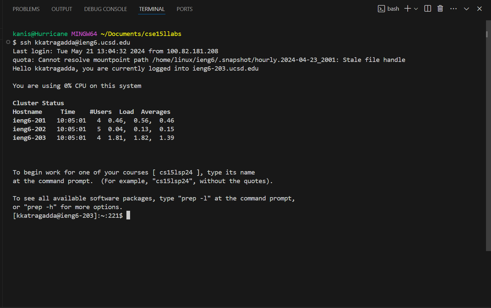
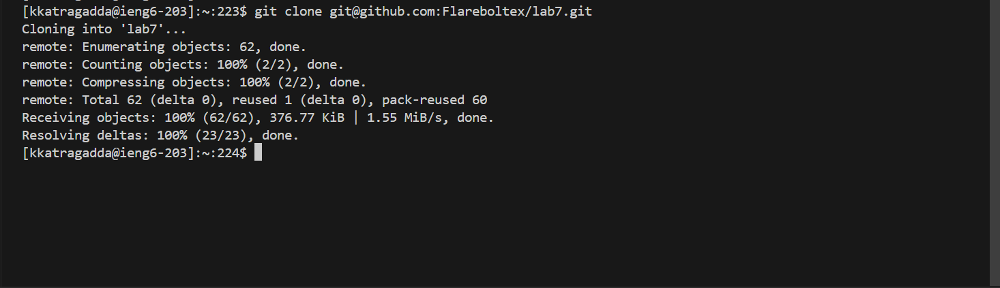
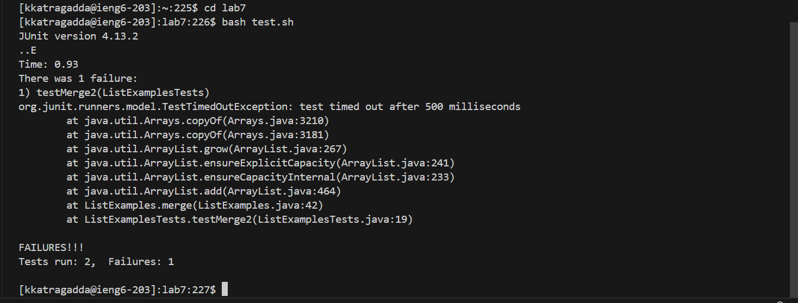
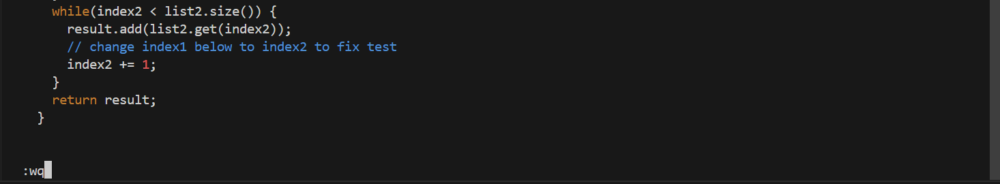
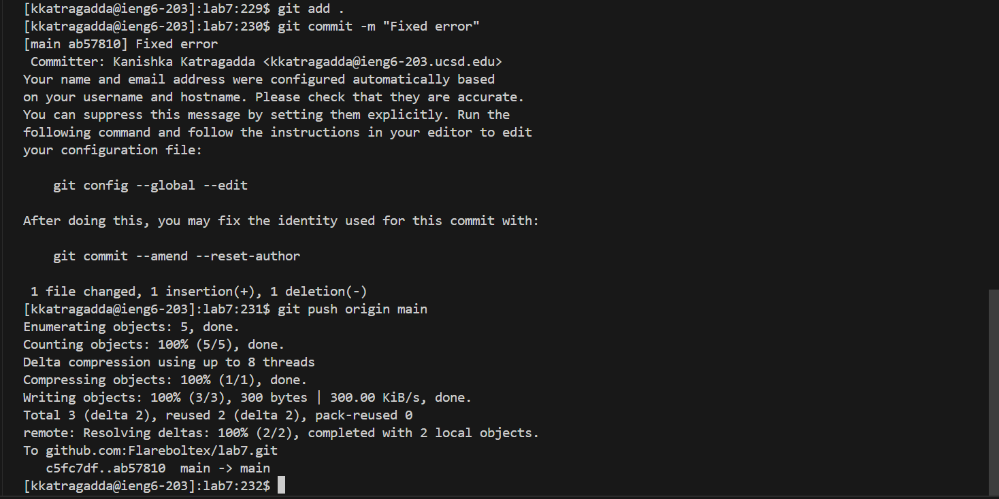

<b>Lab Report 4  </b>
<b>Step 1  </b>
Log into ieng6  
Keys pressed: `ssh <space> kkatragadda@ieng6.ucsd.edu <enter>`  
Summary: Entered the ssh command with a space to give the arguments being my ieng6 account, logging me into ieng6.  
 
<b>Step 2  </b>
Clone your fork of the repository from your Github account (using the SSH URL) 
Keys pressed: `git <space> clone <space> <ctrl> + v + <enter>` 
Summary: Entered the command git clone, pasted the SSH url, and enter to execute and clone the repository. 
 
<b>Step 3  </b>
Run the tests, demonstrating that they fail 
Keys pressed: `cd <space> lab7 <enter> bash <space> test.sh <enter>` 
Summary: Changed directory into the cloned repository, and then bash with the argument of the test file. 
 
<b>Step 4  </b>
Edit the code file to fix the failing test 
Keys pressed: `vim <space> ListExamples.java <enter> <left> xi2 <esc> <shift> :wq`
Summary: Used the vim command on ListExamples.java. Then use left to move onto the appropriate character, hit x to delete, i to enter insert mode, 2 to change it to `index2`, escape to exit insert mode, shift to type the colon and then `:wq` to save and quit. 
 
<b>Step 5  </b>
Run the tests, demonstrating that they now succeed 
Keys pressed: `<up> + <up> + <enter>`
Summary: Used up twice to access the previous usage of `bash test.sh` and executed. 
 
<b>Step 6  </b>
Commit and push the resulting change to your Github account (you can pick any commit message!) 
Keys pressed: `git <space> add <space> . <enter> git <space> commit <space> -m <space> "Fixed error" <enter> git <space> push <space> origin <space> main <enter>`
Summary: Ran the commands to add, commit, and push the changes with the spaces in between each argument. 
 
