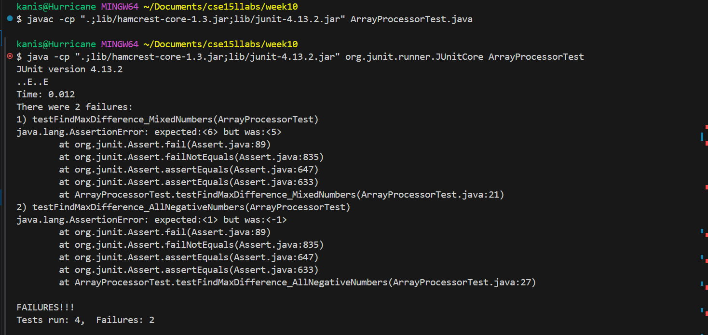

<b>Lab Report 5 <br></b>
<b>Part 1 <br></b>
Hi, my ArrayProcessor isn't passing the tests and I can't seem to figure it out. My best guess is that it something to do with negative numbers, but I can't figure it out. 
<br>
<b>Part 2 <br></b>
You are on the right track with the thought about handling negative numbers. Try to think about difference. Can you have a negative difference? What do you need to consider when calculating the difference between each number?
<b>Part 2 <br></b>
<br>

<b>Before fixing bug <br></b>
```
public class ArrayProcessor {

    public int findMaxDifference(int[] arr) {
        if (arr == null || arr.length < 2) {
            throw new IllegalArgumentException();
        }
        int min = arr[0];
        int maxDiff = arr[1] - arr[0];

        for (int i = 1; i < arr.length; i++) {
            if (arr[i] - min > maxDiff) {
                maxDiff = arr[i] - min;
            }
            if (arr[i] < min) {
                min = arr[i];
            }
        }
        return maxDiff;
    }
}
```
```
import static org.junit.Assert.*;
import org.junit.Test;

public class ArrayProcessorTest {

    @Test
    public void testFindMaxDifferencePositiveNumbers() {
        ArrayProcessor ap = new ArrayProcessor();
        assertEquals(8, ap.findMaxDifference(new int[]{1, 2, 9, 4, 5}));
    }

    @Test
    public void testFindMaxDifferenceNegativeNumbers() {
        ArrayProcessor ap = new ArrayProcessor();
        assertEquals(12, ap.findMaxDifference(new int[]{-3, -2, -6, 0, 6}));
    }

    @Test
    public void testFindMaxDifferenceMixedNumbers() {
        ArrayProcessor ap = new ArrayProcessor();
        assertEquals(6, ap.findMaxDifference(new int[]{7, 1, 5, 3, 6, 4}));
    }

    @Test
    public void testFindMaxDifferenceAllNegativeNumbers() {
        ArrayProcessor ap = new ArrayProcessor();
        assertEquals(1, ap.findMaxDifference(new int[]{-1, -2, -3, -4}));
    }
}
```
