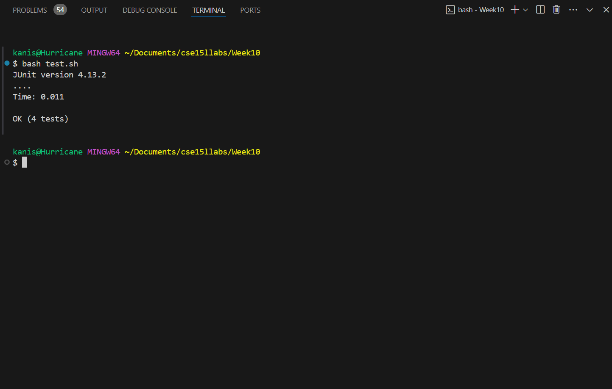

<b>Lab Report 5 <br></b>
<b>Part 1 <br></b>
<b>Step 1 <br></b>
Hi, my ArrayProcessor isn't passing the tests and I can't seem to figure it out. My best guess is that it something to do with negative numbers, but I can't figure it out. 
<br>
<b>Step 2 <br></b>
You are on the right track with the thought about handling negative numbers. Try to think about difference. Can you have a negative difference? What do you need to consider when calculating the difference between each number?
<b>Step 3 <br></b>
<br>
The bug is the student needed to take the absolute value of the difference to account for situations where the first number is smaller than the second. Before it could result in negative differences that were actually larger than the positive differences, but because of the negative sign were treated as smaller. 
<b>Step 4 <br></b>
```
C:\USERS\KANIS\DOCUMENTS\CSE15LLABS\WEEK10
|   ArrayProcessor.class
|   ArrayProcessor.java
|   ArrayProcessorTest.class
|   ArrayProcessorTest.java
|   results.txt
|   structure.txt
|   test.sh
|
\---lib
        hamcrest-core-1.3.jar
        junit-4.13.2.jar
```
<b>Before fixing bug <br></b>
```
public class ArrayProcessor {

    public int findMaxDifference(int[] arr) {
        if (arr == null || arr.length < 2) {
            throw new IllegalArgumentException();
        }
        int min = arr[0];
        int maxDiff = arr[1] - arr[0];

        for (int i = 1; i < arr.length; i++) {
            if (arr[i] - min > maxDiff) {
                maxDiff = arr[i] - min;
            }
            if (arr[i] < min) {
                min = arr[i];
            }
        }
        return maxDiff;
    }
}
```
```
import static org.junit.Assert.*;
import org.junit.Test;

public class ArrayProcessorTest {

    @Test
    public void testFindMaxDifferencePositiveNumbers() {
        ArrayProcessor ap = new ArrayProcessor();
        assertEquals(8, ap.findMaxDifference(new int[]{1, 2, 9, 4, 5}));
    }

    @Test
    public void testFindMaxDifferenceNegativeNumbers() {
        ArrayProcessor ap = new ArrayProcessor();
        assertEquals(12, ap.findMaxDifference(new int[]{-3, -2, -6, 0, 6}));
    }

    @Test
    public void testFindMaxDifferenceMixedNumbers() {
        ArrayProcessor ap = new ArrayProcessor();
        assertEquals(6, ap.findMaxDifference(new int[]{7, 1, 5, 3, 6, 4}));
    }

    @Test
    public void testFindMaxDifferenceAllNegativeNumbers() {
        ArrayProcessor ap = new ArrayProcessor();
        assertEquals(1, ap.findMaxDifference(new int[]{-1, -2, -3, -4}));
    }
}
```
Command: `bash test.sh`

What to edit: Change `int maxDiff = arr[1] - arr[0];` to `int maxDiff = Math.abs(arr[1] - arr[0]);`

<b>Part 2 <br></b>
I learned a lot in this class, as I was pretty much completely new to bash and UNIX commands before this class, and now I feel fairly comfortable with them. I also learned about how TA's go about setting up autograders, something I might be doing a few years from now. On a side note, I also learned a lot about Edwin's research through tutors and what I might be doing next as far as CS goes. 
