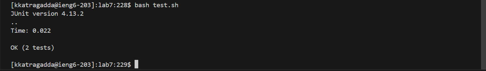

<b>Lab Report 5  </b>
<b>Part 1  </b>
Hi, my ArrayProcessor isn't passing the tests and I can't seem to figure it out. My best guess is that it something to do with negative numbers, but I can't figure it out. 
 
